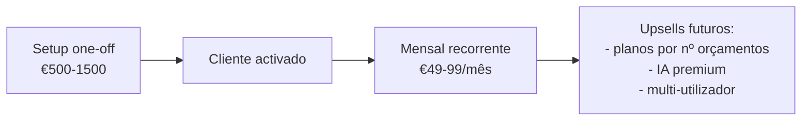
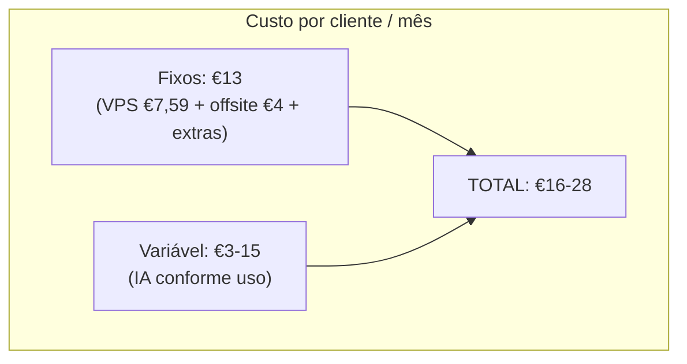

# OBRAXIS — Handoff de Contexto para o CFO

> Documento de transição para o CFO. Vista financeira do produto:
> custos, modelo de receita, unit economics, compliance, riscos, e
> reporting a montar.
>
> Última actualização: 2026-05-04. Responsável anterior: Gonçalo Sousa.
> Documento irmão (vista técnica): `docs/HANDOFF-CTO.md`.

---

## 0. TL;DR financeiro em 8 pontos

1. **Produto:** SaaS B2B de orçamentação para PMEs de remodelações em Portugal. Marca **Obraxis**. Em produção há ~2 semanas com 1 cliente piloto (Sustain Remodelações).
2. **Receita actual:** €0. O cliente piloto está a usar grátis enquanto o produto estabiliza.
3. **Custo unitário por cliente (single-tenant actual):** ~**€11–23 / mês** (VPS €7,59 + IA €3–15 conforme uso + extras). Detalhes na §3.
4. **Pricing recomendado a testar:** **setup €500–1 500 + mensal €49–99**. Ainda não validado em mercado.
5. **Margem bruta projectada:** ~**75–80 %** em single-tenant; ~**90–94 %** em multi-tenant (planeado para próximas semanas).
6. **Estrutura societária:** **a definir.** Hoje não há entidade jurídica para faturar a clientes. É a primeira decisão financeira/legal a fechar.
7. **Compliance:** IVA 23 % sobre SaaS em PT; RGPD aplicável (dados de clientes finais + fotos de obras); sub-processadores Anthropic + Hetzner exigem DPA.
8. **Risco principal:** concentração total num cliente. Sem 5+ clientes, qualquer modelo de receita é teórico. Prioridade comercial > prioridade financeira.

---

## 1. O que é o produto (vista de negócio)

**Quem compra:** sócio/CEO de uma PME de remodelações em Portugal, tipicamente com 1–10 colaboradores e uma equipa de 1–3 orçamentistas.

**Que dor resolve:** orçamentar bem é o estrangulamento das remodelações. Hoje fazem em Excel ou Word, 4–8 horas por orçamento, sem histórico de margem, com erros de quantidades. Perdem obras por demorarem a responder e perdem dinheiro por orçamentarem mal.

**O que o Obraxis faz:**
- Briefing estruturado da visita à obra (40+ campos).
- IA (Claude Sonnet 4.6) lê fotos + briefing e devolve trabalhos sugeridos com quantidades, preços de mercado e riscos identificados.
- Editor de orçamento com tabela de preços própria, IVA, margem alvo.
- Exporta PDF (proposta para cliente final) e Excel (interno).

**Disposição a pagar:** software de gestão para construção em PT custa entre €30 (Moloni nível básico) e €300+ (PHC Remodelações, Construsoft) por mês. O Obraxis posiciona-se na faixa intermédia premium (€49–99/mês) com **vantagem na IA** — nenhum concorrente entrega análise técnica + sugestões de preço a partir de fotos.

**Volume actual:** 1 cliente em uso real, ~10 obras criadas, ~25 orçamentos gerados, ~30 chamadas à IA.

---

## 2. Modelo de receita proposto (a validar)

### Plano Standard (recomendação inicial)

| Item | Valor | Notas |
|---|---|---|
| **Setup** | €500–1 500 | Provisionar instância, importar tabela de preços, branding, training inicial |
| **Mensalidade** | €49–99 | A escolher consoante poder do mercado-alvo |
| **Limite orçamentos** | Ilimitados | A IA é o custo variável real — vale a pena cap em planos baixos? |
| **Utilizadores incluídos** | 3 | Mais utilizadores → upgrade |
| **Suporte** | Email + WhatsApp | SLA 24h dias úteis |
| **SLA uptime** | 99 % (best-effort) | Sem multa contratual nesta fase |

### Variantes a considerar

- **Plano Lite €29/mês** — 1 utilizador, 10 orçamentos/mês, sem IA. Estratégia de funil — converte a Standard em 3–6 meses.
- **Plano Pro €149/mês** — utilizadores ilimitados, IA prioritária, SLA contratual, integração com software de contabilidade. Para empresas com 10+ pessoas.
- **Per-seat alternativa:** €25 / utilizador / mês com mínimo 3. Mais usado em SaaS B2B mas mais difícil de explicar a remodeladores.

**Decisão pendente do CFO:** modelo de plano fechado (Lite/Standard/Pro) versus per-seat.

---

## 3. Custos — estrutura actual

### 3.1 Custos fixos por instância (single-tenant, hoje)

| Item | Custo / mês | Notas |
|---|---|---|
| VPS Hetzner CPX22 | **€7,59** | 8 GB RAM / 4 vCPU / 80 GB SSD; Helsínquia |
| Domínio | **€0** | Hoje sslip.io grátis; passar a `clientexpto.pt` ~€1/mês |
| TLS | €0 | Let's Encrypt automático via Caddy |
| Backups | €0 | Local no VPS (deveria ser offsite ~€4/mês) |
| Monitorização | €0 | Inexistente (deveria ser ~€0–10/mês via UptimeRobot/Better Stack) |
| **Total fixo** | **€7,59 → €13** | Quando se acrescentar offsite + monitoring |

### 3.2 Custos variáveis (Anthropic API)

A IA é o **único custo variável material**. Cada operação custa:

| Operação | Tokens input | Tokens output | Custo / chamada |
|---|---|---|---|
| Análise de obra (4–8 fotos + briefing) | ~10–15 k | ~3–5 k | **~€0,10–0,12** |
| Sugestão de preço (1 linha) | ~2 k | ~500 | **~€0,012** |
| Sugestão de materiais | ~3 k | ~1 k | **~€0,022** |
| Riscos (incluído na análise) | — | — | — |

> Pricing Anthropic Claude Sonnet 4.6: input $3 / 1M tokens, output $15 / 1M (~€2,80 / €14 a câmbio actual).

**Por orçamento típico (uma análise completa + 2–3 sugestões):**
- ~**€0,15–0,30**

**Por cliente / mês a 20 orçamentos/mês:**
- ~**€3–6**

**Por cliente / mês a 50 orçamentos/mês:**
- ~**€8–15**

### 3.3 Custo total por cliente (single-tenant)

### 3.4 Custo em multi-tenant (planeado, próximas semanas)

Quando passarmos a 1 VPS para N clientes:

| Item | Cliente em multi-tenant |
|---|---|
| Fração do VPS | **€0,5–2 / mês** (8–15 clientes por VPS) |
| Domínio | €0 (subdomínio do `obraxis.pt`) |
| Backups | €0,05–0,2 (rateio) |
| IA (variável) | €3–15 (igual) |
| **Total** | **€4–17 / mês** |

A diferença é material: passar de single-tenant para multi-tenant **corta o custo fixo em 80 %** sem perder isolamento de dados (cada cliente tem o seu ficheiro `.db`).

---

## 4. Unit economics (cenário base)

Pricing assumido: **€69 / mês** (meio do range €49–99).

| Métrica | Single-tenant | Multi-tenant |
|---|---|---|
| ARPU (€/cliente/mês) | 69 | 69 |
| COGS (€/cliente/mês) | 22 | 10 |
| Margem bruta | 47 | 59 |
| **GM %** | **68 %** | **86 %** |
| Setup one-off | €1 000 | €1 000 |
| CAC estimado | €300–500 | €300–500 |
| Payback period | ~7–10 meses | ~5–8 meses |
| LTV (24 meses) | €1 656 | €2 416 |
| **LTV / CAC** | **3,3–5,5×** | **4,8–8×** |

**Notas:**
- LTV/CAC > 3 é o threshold mínimo para SaaS saudável; > 5 é forte. A margem em multi-tenant põe-nos no segundo bucket.
- O **setup one-off** absorve a maior parte do CAC nos primeiros 6 meses — útil para limitar burn em early stage.
- Churn assumido 2 %/mês (24 meses retention). É optimista para um produto novo; CFO deve modelar 4–6 %/mês como cenário pessimista.

---

## 5. Cenários de receita (modelo 12 meses)

Assume €69/mês, €1 000 setup, multi-tenant a partir do 5º cliente.

| Mês | Clientes | MRR | Setups (€) | Receita total mês | Custos | Lucro mês |
|---|---|---|---|---|---|---|
| 1 | 1 | 0 | 0 | 0 | 25 | -25 |
| 3 | 2 | 138 | 1 000 | 1 138 | 50 | 1 088 |
| 6 | 5 | 345 | 1 000 | 1 345 | 70 | 1 275 |
| 9 | 10 | 690 | 2 000 | 2 690 | 110 | 2 580 |
| 12 | 18 | 1 242 | 2 000 | 3 242 | 180 | 3 062 |

**Cenário pessimista (3 clientes ao fim de 12 meses):** ~€500–800 MRR. Não cobre o salário do fundador, mas cobre largamente os custos operacionais.

**Cenário optimista (30 clientes):** ~€2 070 MRR + €5 000 acumulado de setups = receita anualizada ~€30 k. Ainda longe de viabilizar full-time, mas suficiente para validar e angariar capital ou parcerias.

> **Conclusão para o CFO:** Obraxis é um produto de **margem alta mas baixa escala intrínseca** (mercado endereçável em PT é estimado em ~5 000 PMEs de construção/remodelações). A tese só funciona se: (a) eventualmente exportar para Espanha/restantes países latinos, ou (b) capturar 5–10 % do mercado PT (250–500 clientes) e operar lean.

---

## 6. Custos one-off de setup do produto

Custos já investidos (em tempo do fundador, **não em dinheiro**):
- Desenvolvimento inicial: ~5 fases ao longo de ~3 semanas
- Infraestrutura: VPS, domínio, deploy automatizado

Custos imediatos a incorrer:
- **Entidade jurídica** (Lda. ou ENI): €380 + €25 IVA + ~€500 contabilidade ano 1
- **Domínio próprio** `obraxis.pt`: ~€15 / ano
- **Logótipo / identidade visual** (a fazer): €0–500 (DIY ou freelancer)
- **Contratos legais base** (T&C, privacy policy, DPA): €500–1 500 (advogado) ou template €0–200
- **Conta bancária empresarial** (BCP, ActivoBank, Caixa): €0–10 / mês
- **Stripe / Easypay / Mollie** (cobrança): 1,4 % + €0,25 por transacção; não tem fee mensal

**Total cash inicial estimado: €1 500–3 000**

---

## 7. Compliance fiscal e legal

### 7.1 Estrutura societária — DECISÃO PENDENTE

| Opção | Setup | Custo / ano | Quando faz sentido |
|---|---|---|---|
| **ENI** (Empresário em Nome Individual) | €0 | ~€800 (contab.) | Receita esperada < €25k; activar IVA aos €13,5k |
| **Lda.** | €380 + €25 | ~€1 500 (contab.) + IRC 17% primeiros €25k | Receita > €25k ou querer separar património |
| **SA** | €5 000+ | €5 000+ | Captação de investimento |

**Recomendação:** começar como **ENI** com isenção de IVA (até €13 500 receita anual). Migrar a Lda. quando passar dos €13,5 k ou quando entrar 2º sócio.

### 7.2 IVA

- **Em PT, SaaS = serviço electrónico = IVA 23 %** se cliente é em PT.
- Cliente B2B em UE: **reverse charge** (não cobramos IVA, cliente declara).
- Cliente B2C em UE: aplicar IVA do país do cliente (regime OSS).
- Cliente fora da UE: sem IVA.
- **Recomendação:** focar PT primeiro, IVA simples 23 %. Quando exportar, tratar OSS via contabilista.

### 7.3 RGPD — sub-processadores e DPA

A plataforma processa dados pessoais de:
- **Utilizadores do cliente** (nome, email, password)
- **Clientes finais do cliente** (nome, NIF, morada, telefone, email)
- **Fotos de obras** (podem ter pessoas, matrículas, propriedade privada)

Sub-processadores:
| Sub-processador | Função | Localização | DPA disponível |
|---|---|---|---|
| Anthropic PBC | API de IA (envio de fotos + texto) | EUA | Sim (Claude Enterprise) |
| Hetzner Online GmbH | Hosting + storage | Alemanha (EU) | Sim |
| Stripe (futuro) | Pagamentos | EUA / Irlanda | Sim |
| Resend (futuro) | Email transaccional | EUA | Sim |

**Documentação a produzir:**
- Política de privacidade pública
- Termos e condições do serviço
- DPA (Data Processing Agreement) para anexar a cada contrato
- ROPA (Registo de Operações de Tratamento) — exigido pela CNPD
- Lista pública de sub-processadores

> ⚠️ **Anthropic processa em servidores nos EUA.** Antes de transferência transatlântica é exigida uma das salvaguardas: SCCs (Standard Contractual Clauses) — Anthropic tem-nas no contrato Enterprise. Validar com advogado de protecção de dados.

### 7.4 Contratos com clientes

Modelo proposto:
- **MSA** (Master Services Agreement) curto (~3 páginas) — quem somos, o que entregamos, SLA, exit clause.
- **DPA anexa** — RGPD obrigatório.
- **Order Form** — define plano, preço, duração, descontos.
- **Aceitação por aceite electrónico** (clicar no checkout, registar timestamp + IP).

Contractar advogado uma vez para fazer os 3 templates: ~€500–1 500.

---

## 8. Riscos financeiros e operacionais

| Risco | Severidade | Mitigação |
|---|---|---|
| **Concentração de cliente** (1 = 100% receita) | 🔴 Alta | Acelerar venda a 5+ clientes em 90 dias |
| Dependência de Anthropic (API única) | 🟠 Média | Avaliar OpenAI / Gemini como fallback técnico |
| Custo IA descontrolado | 🟡 Baixa | Cap por plano + alerts em cents/mês/cliente |
| Cliente recusa pagar (factura vencida) | 🟠 Média | Pagamento upfront via Stripe; cortar acesso ao 7º dia em atraso |
| Falha do VPS (1 servidor único) | 🟠 Média | Backup offsite + plano de DR documentado |
| RGPD breach (foto sensível) | 🟠 Média | Encriptação at-rest, logs de acesso, DPA assinado |
| API key Anthropic exposta | 🟡 Baixa | Já regenerada após handoff CTO; rotação trimestral |
| Custo de aquisição (CAC) descontrolado | 🟠 Média | Mediar via canais orgânicos (referrals, content) antes de paid |
| Câmbio EUR/USD (custos Anthropic em USD) | 🟢 Baixa | Anthropic pode ser facturado em EUR via Console — verificar |
| Concorrente lança produto similar | 🟡 Baixa | Vantagem de 6–12 meses; apostar em features (multi-tenant, IA mais profunda) |

---

## 9. Reporting / dashboards a montar

O CFO deve ter visibilidade sobre estas métricas, **com revisão mensal**:

### KPIs comerciais
- **MRR** (Monthly Recurring Revenue) total e por plano
- **New MRR** vs **Churned MRR** vs **Expansion MRR** (Net New)
- **Número de clientes activos**
- **CAC** (Customer Acquisition Cost) por canal
- **LTV** (Lifetime Value)
- **Payback period**
- **Churn % mensal**

### KPIs operacionais
- **Custo Anthropic / cliente / mês** (alertar acima de €30 — investigar uso)
- **Número de orçamentos gerados / cliente** (proxy de adopção real)
- **Uptime mensal** (target 99 %)
- **NPS / satisfação** (questionário trimestral)

### KPIs financeiros
- **Cash on hand**
- **Burn rate mensal**
- **Runway** (meses até cash €0 ao burn actual)
- **Gross margin %** (receita − custos directos / receita)
- **Receita por contas a pagar** (DSO – Days Sales Outstanding)

### Stack sugerido
- **Stripe Dashboard** — MRR, churn, expansion automaticamente
- **Google Sheets** primeiro 6 meses (não precisas Looker até teres 20+ clientes)
- **Anthropic Console** — custos da API por mês
- **Hetzner Cloud Console** — custos de infra

Quando passar de 20 clientes: **Baremetrics** ou **ChartMogul** (€100–200/mês) automatizam tudo.

---

## 10. Acções imediatas para o CFO (90 dias)

1. **Decidir estrutura societária** (ENI vs Lda.) e abrir conta bancária empresarial. *Bloqueia: facturação a clientes pagos.*
2. **Contratar advogado para T&C + DPA + MSA template** (€500–1 500 one-off).
3. **Definir pricing definitivo** (Lite/Standard/Pro vs per-seat) e integrar em Stripe.
4. **Configurar Stripe** (ou Easypay/Mollie alternativos PT) com facturação automática de assinatura + emissão de facturas com NIF.
5. **Modelo financeiro detalhado** (Excel ou Causal/Pry) com 3 cenários (pessimista/base/optimista) a 24 meses.
6. **Definir politica de IA cap** (cents/mês máximos por plano) e integrar alerts.
7. **DPA com Anthropic e Hetzner** (Enterprise / Business plan se for o caso).
8. **Política de privacidade + T&C públicos** no site (`obraxis.pt/privacidade`, `obraxis.pt/termos`).
9. **Plano de DR** documentado: o que fazer se o VPS arde, se Anthropic vai abaixo, se o fundador é atropelado.
10. **Cap table** se houver 2º sócio ou investidor — mesmo que informal.

---

## 11. Perguntas em aberto que o CFO precisa de resolver com o fundador

1. **Vais incorporar empresa nova (Obraxis Lda.) ou facturar via Adalberto / outro veículo existente?**
2. **Há intenção de captar capital (anjo / pre-seed) ou crescer bootstrapped?**
3. **Que orçamento mensal estás disposto a queimar nos primeiros 12 meses?**
4. **Vai existir 2º sócio (técnico, CTO, comercial) com equity?**
5. **Algum compromisso já assumido com a Sustain (preço fixo, exclusividade, pagamento promissor)?**
6. **Preferência de banco para a conta empresarial?** (BCP / ActivoBank / Caixa / Bancos digitais como Revolut Business)
7. **País-alvo:** só PT, ou abertura imediata a Espanha / Brasil?
8. **Modelo de venda:** self-serve (cliente assina online) ou high-touch (demo + onboarding)?

---

## 12. Documentos relacionados

- `docs/HANDOFF-CTO.md` — vista técnica (arquitectura, stack, deploy)
- `SPEC.md` — especificação funcional do produto
- `PROGRESS.md` — log de desenvolvimento
- `deploy/README.md` — runbook operacional do VPS
