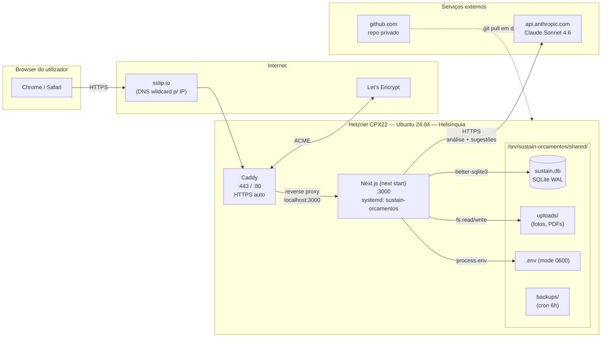
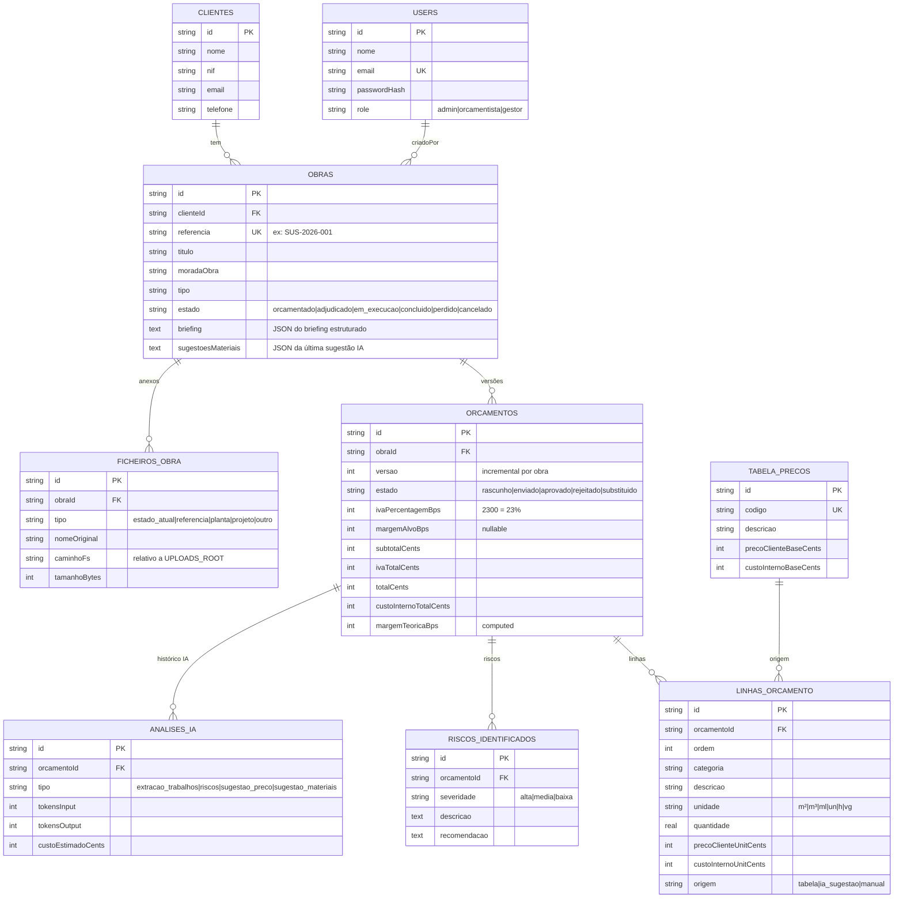
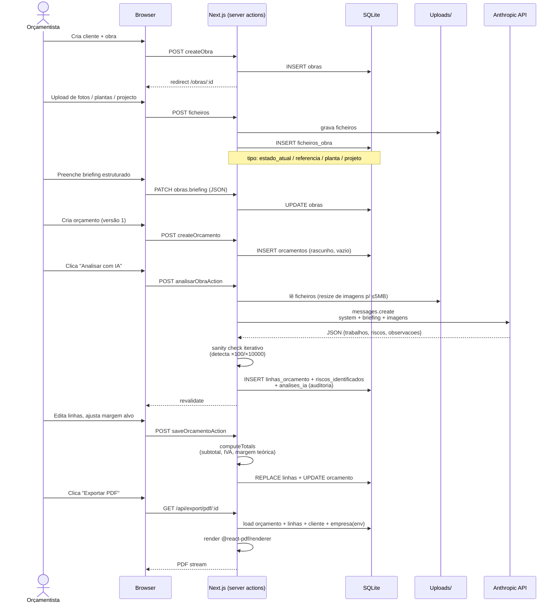
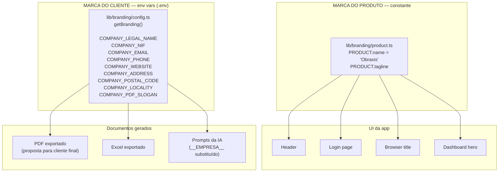
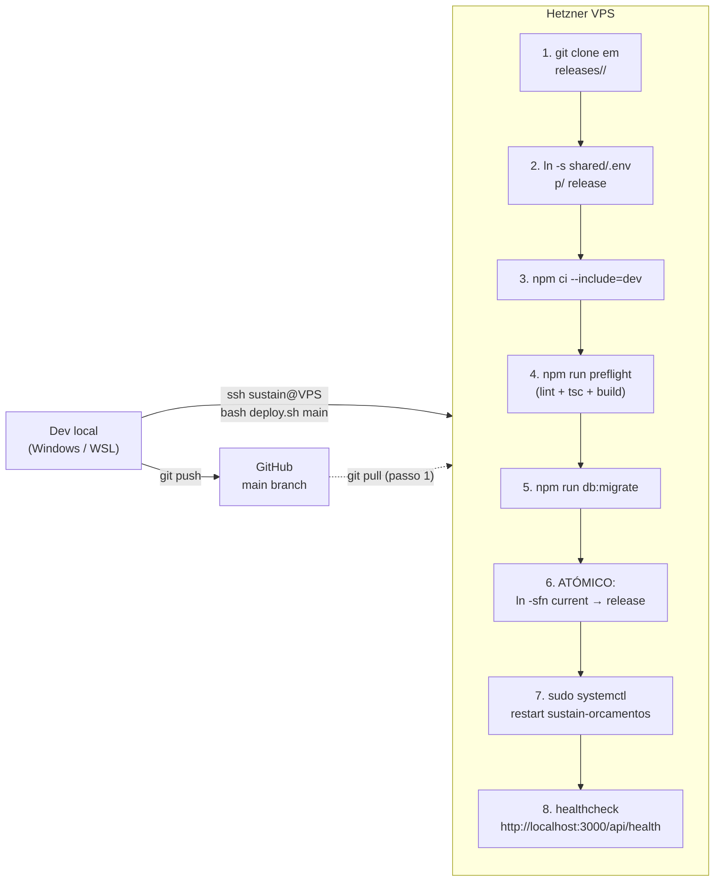
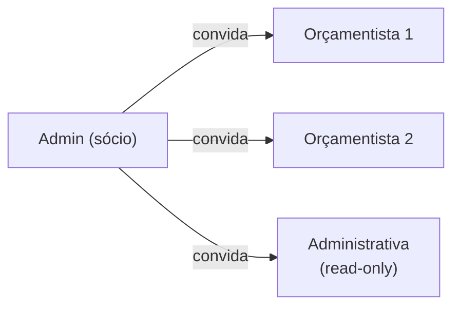
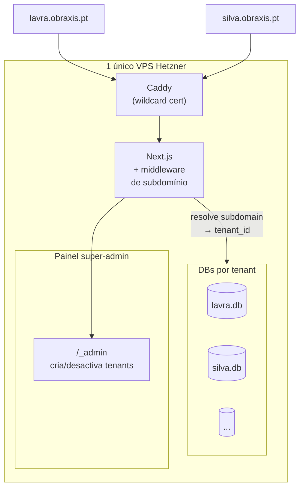

# OBRAXIS — Handoff de Arquitectura

> Documento de transição para o CTO. Descreve o estado actual da
> plataforma, onde estão os dados e como está a correr, com vista à
> replicação para outros clientes.
>
> Última actualização: 2026-04-30. Responsável anterior: Gonçalo Sousa.

---

## 0. TL;DR em 8 pontos

1. **Produto:** plataforma SaaS de orçamentação para empresas de remodelações em Portugal. Marca do produto: **Obraxis**.
2. **Stack:** Next.js 16 (App Router, Turbopack) + React 19 + SQLite + Drizzle ORM + Auth.js v5 + Tailwind v4 + shadcn/ui. IA via Anthropic Claude Sonnet 4.6.
3. **Hosting:** 1 VPS Hetzner Cloud (CPX22, Ubuntu 24.04) em Helsínquia. Caddy faz HTTPS automático (Let's Encrypt) e reverse-proxy para Next.js. Tudo em `/srv/sustain-orcamentos/`.
4. **Persistência:** SQLite **local no VPS** (`/srv/sustain-orcamentos/shared/data/sustain.db`). Uploads em filesystem (`shared/uploads/`). Backups SQLite a cada 6h via cron + retenção de 30 dias.
5. **Modelo actual:** **single-tenant.** 1 instância = 1 cliente. A instância actual corre a **Sustain Remodelações** em https://178-104-203-220.sslip.io.
6. **Branding em dois níveis:**
   - **Produto** (Obraxis) — constante no código, igual para todos.
   - **Empresa cliente** (Sustain) — env vars `COMPANY_*`, aparece nos PDFs/Excel e nos prompts da IA.
7. **Deploy:** push para `main` no GitHub → SSH ao VPS → `deploy.sh` faz git clone numa nova `releases/<timestamp>` → `npm ci` + `preflight` (lint + tsc + build) + `db:migrate` → swap de symlink atómico → `systemctl restart`.
8. **O que falta para SaaS multi-cliente:** sistema de utilizadores com roles (1–2 dias) e multi-tenancy via DB-por-tenant com routing por subdomínio (3–5 dias). Detalhes na §10.

---

## 1. Visão geral do produto

**O que faz:** ajuda um remodelador a converter uma visita à obra num orçamento estruturado, com:

- **Briefing estruturado** (40+ campos: divisões, área, ano de construção, instalações, nível de acabamentos, prazo, prioridade, problemas conhecidos…) em vez de descrição livre.
- **Análise técnica por IA** (Claude Sonnet 4.6) sobre fotos do estado atual + plantas + briefing → devolve trabalhos sugeridos, quantidades, preços de mercado e riscos identificados.
- **Editor de orçamento** com linhas categorizadas, IVA, margem alvo configurável, sugestões pontuais de preço.
- **Tabela de preços** própria do cliente (importável de Excel) reutilizada nos orçamentos.
- **Exportação** para PDF (proposta para cliente final) e Excel (folha de cálculo interna).
- **Sugestões de materiais** e **fluxograma de fases** derivados do orçamento.

**Para quem:** PMEs de remodelações em Portugal. O perfil-tipo é o sócio/CEO que faz visitas e tem 1–3 orçamentistas.

**Volume actual:** 1 cliente em produção (Sustain), ~10 obras criadas, ~25 orçamentos.

---

## 2. Stack técnica

| Camada | Tecnologia | Versão | Notas |
|---|---|---|---|
| Runtime | Node.js | 20 LTS | fixado em `package.json#engines` |
| Framework | Next.js | 16.2.4 | App Router, Turbopack, server actions |
| UI | React | 19.2.4 | + Tailwind v4 + shadcn/ui + Radix |
| ORM | Drizzle ORM | 0.45 | + drizzle-kit para migrations |
| DB | SQLite | via better-sqlite3 12.9 | sync, single-file |
| Auth | Auth.js (NextAuth) | 5.0.0-beta.31 | JWT em cookie, sem OAuth |
| Validação | Zod | 4.3 | inputs de form + payloads de IA |
| IA | Anthropic SDK | 0.90 | Claude Sonnet 4.6 (`claude-sonnet-4-6`) |
| PDF | @react-pdf/renderer | 4.5 | gerado on-demand em rota API |
| Excel | exceljs | 4.4 | idem |
| Reverse-proxy / TLS | Caddy | 2.x | HTTPS automático (Let's Encrypt) |
| Service manager | systemd | — | unit em `deploy/systemd/` |

> ⚠️ **Atenção:** Next.js 16 é uma versão recente com APIs e convenções diferentes da 14/15. Há um `AGENTS.md` no repo que avisa LLMs para consultarem `node_modules/next/dist/docs/` antes de assumir.

---

## 3. Topologia de runtime



**Notas operacionais:**
- Domínio actual: `178-104-203-220.sslip.io` (sslip.io devolve o IP literal — útil enquanto não há domínio próprio). Para passar a `obraxis.exemplo.pt` basta editar `Caddyfile`.
- Caddy renova certificados automaticamente, sem intervenção.
- `systemd` faz restart on-failure; logs vão para journald.
- Firewall (`ufw`): só `:22, :80, :443` expostos.

---

## 4. Modelo de dados



**Convenções:**
- **Dinheiro:** `INTEGER` cêntimos (sufixo `_cents`). Sempre. Nunca floats.
- **Percentagens:** `INTEGER` basis points (sufixo `_bps`). 2300 = 23,00 %.
- **IDs:** UUID v4 gerado em aplicação (`crypto.randomUUID()`).
- **Timestamps:** `INTEGER` ms desde epoch.
- **Totais** são calculados em TS (em `app/(app)/obras/[id]/orcamento/actions.ts#computeTotals`) e gravados — não há `GENERATED COLUMNS`.

**Migrations:** geridas pelo drizzle-kit. Estado actual: 9 migrations (`0000` a `0008`). Aplicadas no deploy via `npm run db:migrate`.

---

## 5. Fluxo do utilizador (briefing → orçamento)



**Pontos não óbvios:**
- A IA pode alucinar preços ×100 ou ×10000 (confunde euros com cêntimos). Há um **sanity check iterativo** em `ia-actions.ts#sanityCheckPrecoEur` que divide por 100 até o valor ser realista para a unidade.
- O save passa **strings em € (`"14,00"`)** para o servidor, não números — para o `moneyCents` schema multiplicar uma única vez. Multiplicar duas vezes foi a fonte de bugs históricos de orçamentos com milhões de €.
- Cada chamada à IA é registada em `analises_ia` (tokens + custo estimado em cents) para auditoria de uso.

---

## 6. Estrutura de pastas

```
sustain/
├── app/                          ← Next.js App Router
│   ├── (app)/                    ← rotas autenticadas (require user)
│   │   ├── page.tsx              ← dashboard (hero + stats + recentes)
│   │   ├── obras/                ← CRUD obras + briefing + ficheiros
│   │   │   └── [id]/
│   │   │       ├── orcamento/
│   │   │       │   └── [orcamentoId]/   ← editor + IA actions
│   │   │       ├── _components/         ← fluxograma + sugestões
│   │   │       └── ficheiros/           ← upload de fotos/plantas
│   │   ├── clientes/
│   │   └── tabela-precos/
│   ├── (auth)/login/             ← rota pública
│   ├── api/                      ← rotas REST
│   │   ├── auth/[...nextauth]/   ← Auth.js
│   │   ├── export/pdf/           ← gera PDF on-demand
│   │   ├── export/xlsx/          ← gera Excel on-demand
│   │   ├── ficheiros/            ← stream de uploads (com auth)
│   │   ├── obras/                ← REST utilitário
│   │   └── health/               ← /api/health (200 OK)
│   └── layout.tsx                ← html shell + branding produto
│
├── components/
│   ├── ui/                       ← shadcn primitives
│   └── app-header.tsx            ← header com PRODUCT.name
│
├── lib/
│   ├── ai/                       ← chamadas Anthropic + prompts
│   │   ├── analise-obra.ts       ← análise completa com fotos
│   │   ├── sugestao-preco.ts     ← sugestão de uma linha
│   │   ├── sugestao-materiais.ts
│   │   ├── client.ts             ← SDK + estimativa de custo
│   │   ├── resize-image.ts       ← resize p/ ≤5MB antes da API
│   │   └── prompts/              ← system prompts (PT)
│   ├── auth/                     ← Auth.js config + requireUser()
│   ├── branding/
│   │   ├── product.ts            ← Obraxis (CONSTANTE)
│   │   └── config.ts             ← empresa cliente (env vars)
│   ├── data/briefing-obra.ts     ← schema do briefing estruturado
│   ├── db/
│   │   ├── schema.ts             ← Drizzle table defs
│   │   ├── index.ts              ← getDb() singleton
│   │   ├── migrate.ts            ← script de migration
│   │   ├── seed.ts               ← cria admin inicial
│   │   └── migrations/           ← SQL files + meta/_journal.json
│   ├── export/
│   │   ├── pdf.tsx               ← @react-pdf
│   │   ├── xlsx.ts               ← exceljs
│   │   └── load-orcamento.ts     ← carrega tudo + branding
│   ├── uploads/storage.ts        ← path resolution + write
│   └── validation/               ← Zod schemas (orcamento, obra, shared)
│
├── deploy/
│   ├── README.md                 ← runbook completo (~400 linhas)
│   ├── caddy/Caddyfile           ← config reverse proxy
│   ├── systemd/sustain-orcamentos.service
│   └── scripts/
│       ├── deploy.sh             ← release atómica
│       ├── healthcheck.sh
│       ├── backup-rotate.sh      ← cron 6h, retenção 30d
│       └── db-restore.sh
│
├── scripts/                      ← utilitários TS (correr com tsx)
│   ├── db-backup.ts              ← VACUUM INTO
│   ├── fix-orcamento-precos.ts   ← retroactivo p/ bugs IA
│   ├── fix-iva-bps.ts
│   └── clean-fix-retroactivo-notas.ts
│
├── docs/
│   ├── adr/                      ← decisions de arquitectura
│   └── HANDOFF-CTO.md            ← este ficheiro
│
├── PROGRESS.md                   ← log de fases de desenvolvimento
├── SPEC.md                       ← especificação funcional original
└── AGENTS.md                     ← instruções p/ LLMs
```

---

## 7. Branding em dois níveis



**Regra:** se aparece no chrome da app (header, login, title), vem do **PRODUTO**. Se aparece num documento que o cliente final vê (PDF, Excel) ou num prompt da IA, vem do **CLIENTE**.

---

## 8. Pipeline de deploy



**Características:**
- **Releases nunca apagadas:** rollback é `ln -sfn current → releases/<timestamp_anterior>` + restart. Disco é grande, manter histórico.
- **Migrations correm ANTES do swap:** se falhar, release nova é descartada e `current` continua na anterior.
- **Healthcheck final:** se 503/erro, mostra comando de rollback no stdout.
- Tempo total típico: **~90 segundos** (dominado pelo `next build`).

---

## 9. Estado actual da instância (Sustain)

| Item | Valor |
|---|---|
| Servidor | Hetzner Cloud CPX22 — Helsínquia |
| Recursos | 8 GB RAM, 4 vCPU, 80 GB SSD |
| OS | Ubuntu 24.04 LTS |
| Custo VPS | ~7,59 €/mês |
| Domínio | sslip.io (gratuito) — `178-104-203-220.sslip.io` |
| TLS | Let's Encrypt via Caddy (renova-se sozinho) |
| DB | SQLite, ~5 MB, WAL mode |
| Uploads | ~50 MB |
| Backups | Cron a cada 6h, retenção 30d, em `shared/backups/` |
| API IA | Anthropic Claude Sonnet 4.6 |
| Custo IA | ~€0,15–0,30 por orçamento completo |
| SLA | Best-effort (sem multi-AZ, sem failover) |

**O que falta para "produção a sério":**
- Backups offsite (hoje vivem no mesmo VPS).
- Monitorização (uptime + logs estruturados).
- Domínio próprio + DNS gerido.
- Plano de DR documentado.

---

## 10. Plano de replicação para outros clientes

### Hoje — single-tenant, 1 VPS por cliente

Para cada novo cliente:

1. Provisionar VPS Hetzner (script existe em `deploy/README.md`).
2. Criar `.env` partilhada com:
   - `AUTH_SECRET` novo (32 bytes random)
   - `ANTHROPIC_API_KEY` (chave isolada por cliente, para auditoria)
   - `COMPANY_LEGAL_NAME`, `COMPANY_NIF`, `COMPANY_EMAIL`, etc. do cliente
   - `DATABASE_PATH`, `UPLOADS_ROOT`, `BACKUP_DIR` (paths partilhados)
3. Correr `db:migrate` + `db:seed` (cria user admin do cliente).
4. Configurar Caddy com domínio do cliente (HTTPS automático).
5. Importar tabela de preços do cliente (Excel → `/tabela-precos/importar`).

**Tempo:** ~30 min de provisionamento. **Custo marginal:** ~€13/mês por cliente (VPS + IA).

### Próximo passo — utilizadores com roles dentro do tenant (1–2 dias)

Quase obrigatório para vender — hoje só existe 1 user admin por instância.



Mudanças necessárias:
- Tabela `users` já existe com `role`. Falta:
  - Páginas `/equipa` (listar, convidar, desactivar).
  - Coluna `created_by_user_id` em `obras`, `orcamentos`, `ficheiros_obra` (auditoria).
  - RBAC nas server actions: `viewer` não pode aprovar orçamentos, etc.
  - Convite por email (Resend free tier).

### Passo seguinte — multi-tenant verdadeiro (3–5 dias)

Em vez de 1 VPS por cliente, **1 VPS para N clientes** com isolamento por DB.



**Arquitectura recomendada — DB-por-tenant:**
- Routing por subdomínio: `lavra.obraxis.pt`, `silva.obraxis.pt`.
- Middleware Next.js extrai o subdomínio e instancia a DB correspondente.
- Cada `<tenant>.db` é um ficheiro SQLite independente.
- Isolamento total: GDPR, "apagar conta" = `rm`, zero risco de leak entre tenants.
- 1 VPS aguenta 50–100 tenants pequenos.

**Trade-off:**
- ✅ Simples, isolamento físico, baixo risco.
- ❌ Migrations correm N vezes (uma por DB) — gerir com fila.
- ❌ Backups têm de iterar todas as DBs.

Alternativa (schema partilhada com `tenant_id`): mais barata em escala (>500 tenants) mas invasiva — todas as ~30 queries actuais teriam de ganhar filtro por `tenant_id`. **Não recomendado para a fase actual.**

---

## 11. Bug fixes e dívida técnica recente

### Resolvidos

| Issue | Causa | Fix |
|---|---|---|
| Orçamentos com 8 milhões € | Frontend mandava `precoClienteUnitCents: 1400` (number), schema `moneyCents` com `parseEuroString` × 100 → 140 000 cents | Frontend manda **string em €** (`"14,00"`), servidor multiplica uma única vez |
| IVA × 100 | Mesmo padrão do anterior, mas no campo IVA | Schema `percentageBps` com limite máx 10000 + frontend manda string |
| IA hallucinava preços ×100/×10000 | LLM confunde "1400 cents" com "1400 €" | Sanity check **iterativo** em `sanityCheckPrecoEur()` — divide por 100 até o valor ser realista para a unidade |
| Sugestões/fluxograma apareciam antes dos uploads | Fluxograma derivado da última obra recente em vez do orçamento actual | Reordenado: ficheiros antes do briefing; sugestões + fluxograma movidos para a página do orçamento |
| Notas internas `[FIX RETROACTIVO]` no PDF do cliente | Script de fix escrevia em `linhas_orcamento.notas` (visível) | Script passou a só fazer log; cleanup retroactivo via `clean-fix-retroactivo-notas.ts` |
| `npm ci` saltava devDeps em prod (eslint, tsx) | `NODE_ENV=production` com `npm ci` ignora devDeps | Forçado `npm ci --include=dev` no `deploy.sh` |
| `.env` source falhava com espaços (`Gonçalo Duarte`) | `set -a; source .env` não tolera valores não quotados | Sed envolve todos os valores em aspas simples |
| Caddy log permission denied | `/var/log/caddy/access.log` root-owned | Removido bloco de log; usa journald |

### Dívida técnica conhecida

1. **Sem testes automatizados.** Há `preflight` (lint + tsc + build) mas zero unit/integration tests. Risco médio.
2. **Único user admin por instância.** Ver §10.
3. **Backups vivem no mesmo VPS.** Se o VPS for destruído, dados perdem-se. Adicionar offsite (Hetzner Storage Box ou S3-compatível).
4. **`fundadores.png` não usado** em `/public/` — ficou da versão pré white-label. Pode-se apagar.
5. **`OBRA LAVRA/`** na raiz do repo — pasta de fotos de teste, devia estar em `data/` ou ignorada.
6. **`AUTH_SECRET` actual** já foi usado em dev. Em produção a sério, regenerar.
7. **Prompts da IA são longos** (~200 linhas em PT). Cada análise gasta ~10–15k tokens de input. Optimização via prompt caching da Anthropic baixa o custo em ~80 % nas chamadas seguintes.

---

## 12. Como começar (CTO)

```bash
# 1. Clonar
git clone git@github.com:goncaloscsousa-max/sustainorcamentos.git obraxis
cd obraxis

# 2. Setup local
cp .env.example .env
# preencher AUTH_SECRET, ANTHROPIC_API_KEY, ADMIN_EMAIL, ADMIN_PASSWORD
npm ci
npm run db:migrate
npm run db:seed
npm run dev

# 3. Aceder
# http://localhost:3000/login → entrar com o ADMIN_EMAIL/PASSWORD

# 4. Ver estado da DB
npm run db:studio  # abre Drizzle Studio
```

**Para ver a instância live da Sustain:**
- URL: https://178-104-203-220.sslip.io
- SSH: `ssh -i ~/.ssh/sustain_vps sustain@178.104.203.220` (chave passada à parte)
- App em `/srv/sustain-orcamentos/current/` (symlink para release activa)
- Logs: `journalctl -u sustain-orcamentos -f`

**Documentos de leitura recomendada (por ordem):**
1. Este ficheiro.
2. `SPEC.md` — especificação funcional original.
3. `deploy/README.md` — runbook completo.
4. `PROGRESS.md` — log das 5 fases de dev.
5. `docs/adr/` — decisões arquitecturais.

---

## 13. Contactos e responsabilidades

| Tema | Responsável | Notas |
|---|---|---|
| Produto / negócio | Gonçalo Sousa | gsousa@adalberto.pt |
| Domínio sslip.io actual | — | gratuito; passar a domínio próprio quando houver branding final |
| Conta Hetzner | Gonçalo Sousa | acesso à consola web |
| GitHub repo | Gonçalo Sousa (`goncaloscsousa-max`) | repo privado |
| Anthropic API key | Gonçalo Sousa | uma key por cliente em prod |
| Auth.js secrets | env `AUTH_SECRET` | regenerar antes de cada nova instância |
